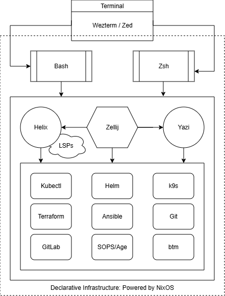

# Bastion 2 (Managed SRE Environment)

> A fully declarative, reproducible, and secure gateway for infrastructure automation.

Powered by **NixOS 25.11**, **Flakes**, and **Helix**.

## The Engine Room: System Architecture



## Initial Setup

1. Install **NixOS 25.11** (No Desktop)
2. Login as your user
3. `nix-shell -p git`
4. `git clone https://github.com/aalekseenkov/dotfiles4nixos.git ~/.dotfiles`
5. `cd ~/.dotfiles`
6. `./ship --reconf`

## Ship It Smart and Fast

The `ship` script is the orchestrator of the **Bastion 2** environment. It automates the "dirty work" of staging local hardware/network configurations and applying system changes safely through NixOS Flakes.

### Core Commands:
* `./ship` - **daily update**. The standard way to rebuild your system. It uses existing hardware and network configurations to apply updates to your software or dotfiles.
* `./ship --reconf` - **reconfigure**. Forces a full reset of local settings. Use this to change your Hostname, Network Interface, or switch between Static and DHCP modes.
* `./ship --dhcp` - **rapid DHCP**. A shortcut for non-static environments. It skips static IP prompts and configures the system to use **NetworkManager** and **DHCP** automatically. Use `./ship --reconf --dhcp` to instantly migrate from a static VM to a laptop/cloud environment.

### The Git-Powered Configuration Lifecycle:
To maintain a purely declarative build while keeping private infrastructure data (IPs, Gateway, Hardware UUIDs) out of public repositories, the script follows a specific lifecycle:

1.  **Staging**: It executes `git add -f` on `local-networking.nix` and `hardware-configuration.nix`. This "forces" Nix Flakes to see these files during the build process, even if they are gitignored.
2.  **Building**: It runs `nixos-rebuild switch --flake .#nixos` to apply the new state.
3.  **Cleanup**: Immediately after a successful (or failed) build attempt, it runs `git reset` on these files.
4.  **Result**: Your private infrastructure details remain in the "Not staged for commit" (red) zone. You get a fully reproducible system without ever leaking your private network topology to GitHub.

## Customization

To adapt this configuration, edit the variables in the `let` block of your **`flake.nix`**. This is the single source of truth:

```nix
# flake.nix
let
  user = "your_name";               # System username & home directory
  gitName = "Your Full Name";       # Git author name
  gitEmail = "your@email.com";      # Git author email
in
```

## Git Signing & Security

*   **SSH Signing** - this repo is configured to sign commits using your SSH key.
*   **Verified Status** - ensure your public SSH key is added to GitHub as a **Signing Key** (not just an Authentication key) to get the "Verified" badge.
*   **Private Data** - `hardware-configuration.nix` and `local-networking.nix` are excluded from commits to keep your infrastructure private.

## Tooling Stack

*   **Editor:** Helix (`hx`) with specialized LSPs:
    *   `ansible-language-server` (Forced Unstable version)
    *   `yaml-language-server`
    *   `bash-language-server`
    *   `nil` (Nix LSP)
    *   `marksman` (Markdown LSP)
*   **Shell:** Zsh + **Starship**. Features a custom **two-line prompt** for deep directory navigation and Git status visibility.
*   **Utils:** Yazi (terminal file manager), Docker, and Zram support.

*The list is updated as it develops.*

## Deploy SSH Keys

### 1. Windows Host -> NixOS Bastion -> Remotes

```
# Bastion (NixOS)
# Initialize Environment
mkdir -p ~/.ssh && chmod 700 ~/.ssh

# Windows Host (Powershell)
# Inbound access (Windows to Bastion)
scp $HOME\.ssh\id_ed25519_windows.pub your_user@IP:~/.ssh/authorized_keys
# Outbound identities (Bastion to Remotes)
scp $HOME\.ssh\id_ed25519_git your_user@IP:~/.ssh/id_ed25519_git
scp $HOME\.ssh\id_ed25519_git.pub your_user@IP:~/.ssh/id_ed25519_git.pub

# Bastion (NixOS)
# Permission Hardening
chmod 600 ~/.ssh/authorized_keys
chmod 600 ~/.ssh/id_ed25519_git
chmod 644 ~/.ssh/id_ed25519_git.pub

# SSH Keys Quick Testing
ssh -T git@github.com

# The six steps to config SSH on Windows Host
# Powershell Administration
# 1. Navigate to the SSH directory
cd $env:USERPROFILE\.ssh
# 2. Open SSH config
notepad config
# 3. Add and update your host into config file
Host bastion
    HostName 192.168.100.100
    User ava
# 4. Remove inherited permissions (isolate the file)
icacls config /inheritance:r
# 5. Grant Full Control only to the current user
icacls config /grant:r "${env:USERNAME}:F"
# 6. Grant Full Control to the SYSTEM account
icacls config /grant:r SYSTEM:F
```

## GitLab CLI Setup and Usage

### 1. Authentication Token

To manage pipelines and repositories from the terminal, we need a Personal Access Token (PAT):
- **Required scopes:** api, read_api, write_repository, read_repositore
- **Role:** Developer (or higher)

### 2. Connection Command

Run the interactive login and follow the prompts:

```
glab auth login
```

- **Instance:** gitlab.com
- **Method:** Token
- **Protocol:** SSH
- **API Protocol:** HTTPS

### 3. Pipeline Monitoring

- `glab pipeline ci view` - interactive TUI to watch pipeline stages and logs
- `glab pipeline ci status` - quick summary of the last pipeline status
- `glab ci trace` - stream logs of a running job (interactive selection)
- `glab pipeline list` - list recent pipelines for the current branch

### 4. Job Management

- `glab ci retry` - rerun the last failed job
- `glab pipeline create` - manually trigger a new pipeline on the current branch
- `glab ci run` - run a specific job manually (if defined as manual in YAML)

### 5. Repository & MRs

- `glab repo view` - display project description and stats
- `glab mr list` - list open Merge Requests in the current project
- `glab mr checkout <id>` - quickly switch to the branch of a specific MR

### 6. Pipeline View Interactivity

| Key | Action |
| :--- | :--- |
| `Enter` | View logs for the selected job |
| `R` | Retry the selected job |
| `C` | Cancel the selected job (if running) |
| `Q` | Exit the view |

## Miscellaneous

### 1. Generate Local Identity (Alternative)

```
ssh-keygen -t ed25519 -C "bastion-v2"
```

### 2. Switching remote URLs from HTTPS to SSH
```
git remote set-url origin git@github.com:OWNER/REPOSITORY.git
git remote -v
```

## Useful Links
[Installing NixOS in a VirtualBox guest](https://nixos.org/manual/nixos/stable/#sec-installing-virtualbox-guest)

---
*Maintained by aalekseenkov. "Ship it!"*
